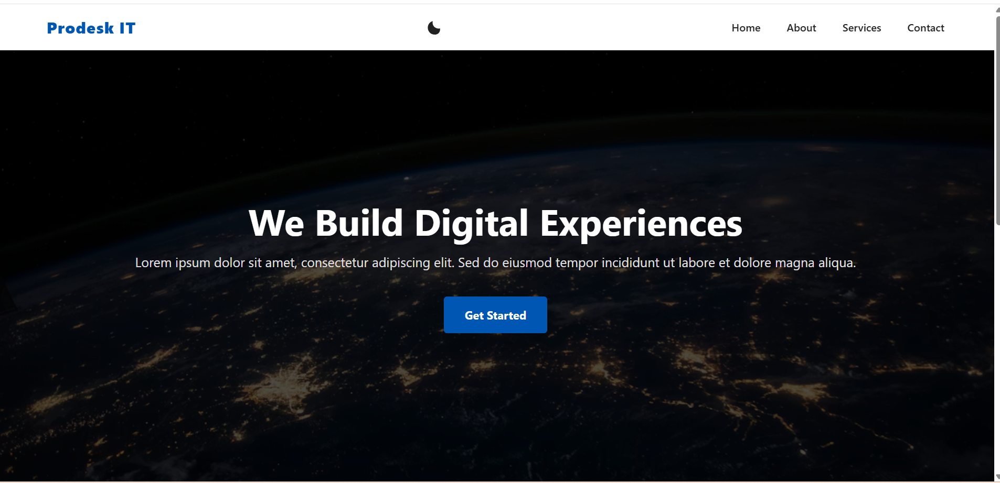
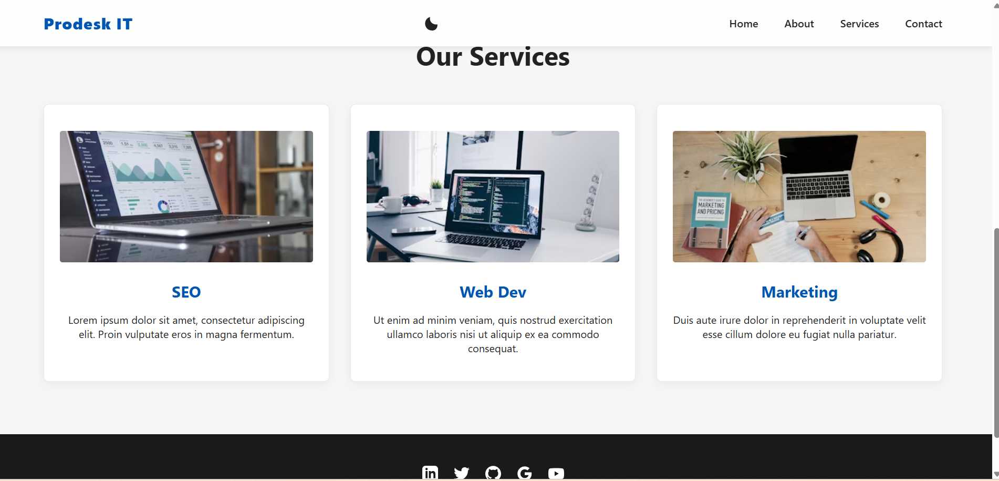
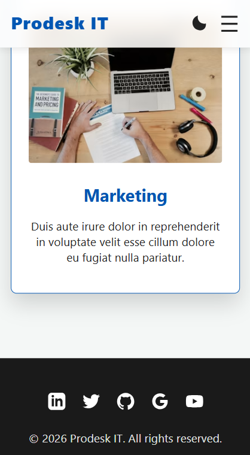

# Prodesk IT | Sprint 1: The Corporate Brand

**Live Deployment:** [Insert Live URL Here, e.g., https://prodesk-it-sprint1.vercel.app]

## Project Overview

This repository contains the deliverables for the Prodesk IT digital marketing wing. The objective was to architect a high-conversion, responsive landing page emphasizing foundational DOM manipulation, CSS Object Model understanding, and strict performance metrics without the use of external UI frameworks like Tailwind or Bootstrap (optional).

## Desktop & Mobile View

## Technical Features & Phased Deliverables

### Phase 1: Base MVP Architecture

- **Semantic HTML5:** Built with strict accessibility landmarks (`<main>`, `<header>`, `<footer>`).
- **Fluid CSS Grid & Flexbox:** Fully responsive layout utilizing mathematical constraints (`minmax`, `1fr`) eliminating the need for excessive media queries.
- **Mobile-First Navigation:** Custom "Checkbox Hack" hamburger menu implementation utilizing zero JavaScript.

### Phase 2: UI/UX Enhancements

- **Vanilla JS Theme Controller:** Global Dark/Light mode state management utilizing CSS Custom Properties (Variables) via `classList.toggle`.
- **Micro-Interactions:** Z-axis elevation scaling (`box-shadow`, `transform`) on service cards with cubic-bezier timing functions.
- **Sticky Header:** Persisted Z-index navigation layout for seamless scrolling.

### Phase 3: QA & Performance Optimization

- **Perfect Lighthouse Scores:** Achieved **100/100** in both Performance and Accessibility audits.
- **LCP & Bandwidth Optimization:** Implemented `rel="preload"` and `fetchpriority="high"` for critical path rendering, paired with `loading="lazy"` and `decoding="async"` for non-critical assets.
- **Modern UI Patterns:** Integrated Glassmorphism (`backdrop-filter: blur`) into the dark-mode compatible sticky navigation.

## Tech Stack

- **HTML5** (Vanilla)
- **CSS3** (Variables, Grid, Flexbox)
- **JavaScript** (ES6+, DOM Manipulation)

## Security Posture

- Implemented `rel="noopener noreferrer"` on all external routing to prevent cross-site tabnabbing vulnerabilities.

---

_Engineered for Prodesk IT Sprint 1._
